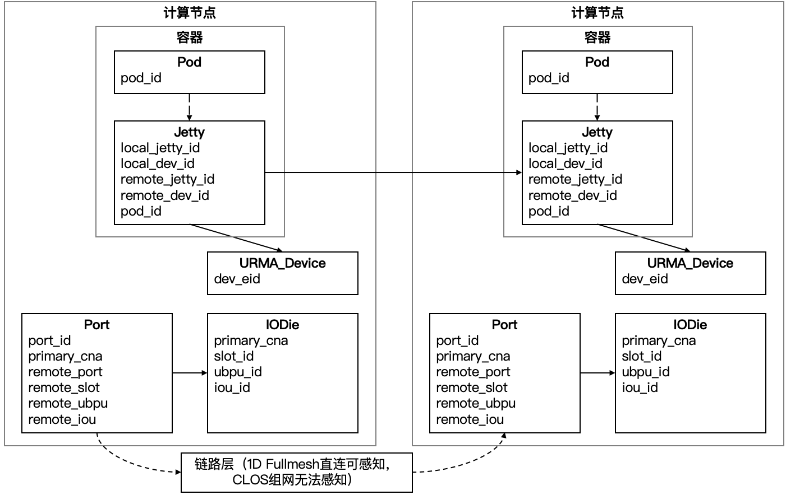

# witty-ub

灵衢（UnifiedBus，简称UB）是一种面向计算系统的互联技术与架构。基于统一的互联技术，UB系统中的所有处理单元处于对等地位、所有资源可以池化共享，实现资源灵活组合和高效协同计算。

然而，在提供资源的高效协同机制的同时，灵衢架构在运维和故障诊断领域提出了新的挑战:
* 灵衢超节点集群中，单节点的资源故障可能通过共享或借用等依赖关系扩散至其他节点上，然而目前各组件、节点仅持有碎片化的局部系统资源信息，无法支撑跨节点的故障诊断；
* 灵衢超节点故障具有跨组件、多模态的多源日志，这些日志相互交织，难以识别哪些日志属于同一个故障事件，干扰诊断过程；
* 灵衢超节点架构引入了新的复杂故障模式，当前的人工和智能化故障诊断方法缺乏相关经验与知识，导致故障诊断困难、准确率低。

**witty-ub**提供了面向灵衢超节点可用性故障的故障信息采集和智能诊断工具，支持容器和非容器部署两种业务形态。

* 拓扑采集工具**witty-ub-topo**基于管控面、控制面、数据面组件提供的查询接口和日志信息，提供跨栈、跨节点的资源拓扑采集功能，用于构建系统关键资源的依赖关系，进而在故障诊断时推断故障源;
* 日志采集工具**witty-ub-log**对各组件日志进行采集，并进一步识别系统中的重要故障事件，将上下游组件的相关日志与故障事件进行关联，以提供更加全面的、准确的故障事件信息;
* 故障诊断工具**witty-ub-diag**（即将到来）基于故障信息和领域知识，利用大模型进行故障诊断。

以下链接可协助您使用witty-ub:

* [witty-ub快速使用指导](docs/quick-start.md)涵盖了编译和使用witty-ub组件的全流程。

## 特性介绍

### 拓扑采集（witty-ub-topo）

灵衢超节点资源间存在依赖关系，某一资源发生的故障会随着依赖关系传播到其他资源。因此在故障诊断时，需要构建系统资源拓扑，用于反向推断故障源。**witty-ub-topo**当前支持面向URMA通信场景的拓扑采集功能，采集的资源类型和采集方法如下：

* **Pod**：节点部署的容器，仅当业务为容器部署形态时有效，通过用户的命令行输入进行采集。
* **Jetty**：URMA创建的通信jetty资源，通过UMQ的建链日志打印进行采集。
* **URMA_Device**：URMA通信设备资源，通过UMQ的建链日志打印进行采集。
* **Port**：通信端口，通过UBM提供的系统拓扑查询接口进行采集。
* **IODie**：IO芯片，通过UBM提供的系统拓扑查询接口进行采集。

资源间的依赖关系和关键字段如下：

更多详细信息，可见[使用指导](docs/quick-start.md#超节点系统拓扑实时感知工具witty-ub-topo使用指导)。

### 日志采集（witty-ub-log）

日志是超节点故障的重要信息源，全面采集灵衢超节点各个功能组件的日志并准确识别故障事件及关联日志，是故障诊断的重要步骤。**witty-ub-log**当前支持面向URMA通信的日志采集、事件识别和日志关联功能。基于关键字筛选组件日志，支持采集的通信组件有：

* **UbSocket**：UB通信生态构建，兼容Socket编程接口，使能TCP应用零修改提升网络通信性能。
* **UMQ**：基于LD/ST语义，使用共享内存实现的高性能传输组件。
* **URMA**：统一内存语义，提供可单边、双边、原子操作等远端内存操作方式。支持URMA用户态组件libURMA和内核态组件URMA core的日志采集。
* **UDMA**：UB硬件驱动，提供网络层数据收发能力。支持UDMA用户态组件libUDMA和内核态组件UDMA core的日志采集。

支持识别**建链、删链、数据面**三类主要故障，通过识别UMQ组件的相关操作入口函数打印的非debug、info级别日志实现。

完成故障事件识别后，进一步通过时间和资源维度的信息，识别事件的关联日志：

* **时间维度**：事件关联日志的打印时间需要临近事件发生时间。对于UMQ的上游组件（UbSocket）日志，其时间范围设置为事件发生后10秒内；对于UMQ及其下游组件（libURMA、URMA core、libUDMA、UDMA core），其时间范围设置为事件发生前10秒内。

* **资源维度**：事件关联日志应该与事件相关资源匹配。对于UMQ和libURMA日志，资源类型有程序名和进程名；对于UMQ日志，资源类型还有本端和对端的jetty和URMA设备。

更多详细信息，可见[使用指导](docs/quick-start.md#超节点多源系统日志解析工具witty-ub-log使用指导)。

## Roadmap

### 即将到来

* [ ] 新增智能故障诊断功能：提供witty-ub-diag工具，基于大模型进行灵衢超节点智能故障诊断。
* [ ] 更智能的日志解析：构建跨组件的函数和日志模板树，实现函数级精准日志关联。
* [ ] 更多的应用场景：支持内存借用场景的故障信息采集和智能诊断。

### 当前进展

* [x] witty-ub发布
* [x] 支持URMA通信故障场景
* [x] 支持灵衢超节点故障采集功能
* [x] 支持灵衢超节点日志采集功能

## How to Contribute

我们非常欢迎新贡献者加入到项目中来，也非常高兴能为新加入贡献者提供指导和帮助。您可以通过issue或者合入PR来贡献

## Licensing

witty-ub 使用 Mulan PSL v2.
